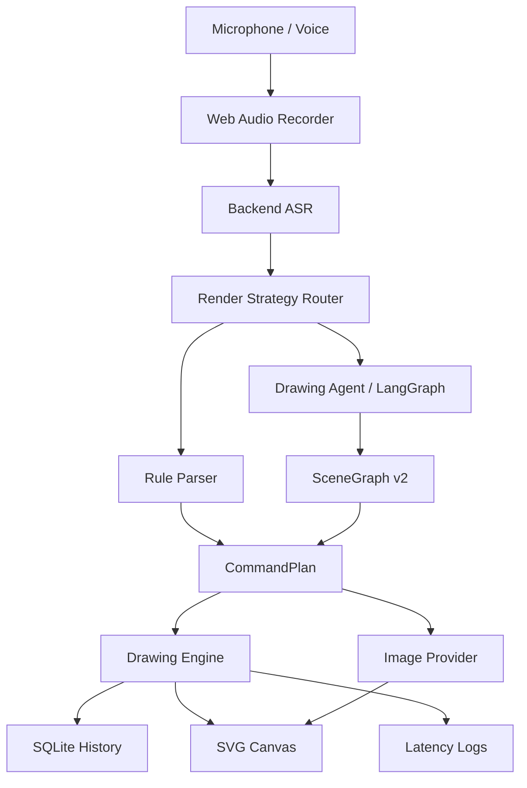

# AI Painting

<div align="center">

**Voice-first editable drawing agent for structured diagrams, vector scenes, and image refinement.**

**纯语音控制的可编辑绘图 Agent, 面向结构图、矢量场景和图生图精修。**

[](https://github.com/SakuraCianna/AI-Painting/actions/workflows/ai-painting-ci.yml)
[](https://www.python.org/)
[](https://nodejs.org/)
[](https://react.dev/)
[](https://fastapi.tiangolo.com/)

[简体中文](#简体中文) | [English](#english)

</div>

---

## 简体中文

AI Painting 是一个 **纯语音绘图工作台**。用户不通过鼠标拖拽或键盘快捷键绘图, 而是用中文语音完成创建画布、生成图形、修改对象、撤销恢复、确认高风险操作、生成图片和精修图片。

这个项目的核心方向不是做一个普通文生图工具, 而是做一个 **可解释、可撤销、可继续编辑** 的绘图 Agent:

```txt
语音 -> ASR -> 渲染策略路由 -> 规则解析 / Drawing Agent -> 结构化计划 -> SVG 画布 / 图片对象
```


### 为什么值得关注

- **纯语音创作**: 前端没有鼠标拖拽绘图工具栏, 语音是唯一创作输入。
- **矢量优先**: 房子、流程图、甘特图、组织结构图、UI 草图等结构化内容走程序生成, 保持文字清晰、关系稳定、对象可编辑。
- **生图增强**: 水墨、二次元、写实插画、复杂视觉海报等艺术型内容可走 GPT-image-2 / OpenAI 兼容 Provider。
- **图生图精修**: 支持“精修我的图片”“把右边那个人的眼睛调亮”“继续把他的头发柔和一点”“再亮一点”等指令, 会把源图、原始提示词、目标主体、目标区域和调整动作一起传给图像编辑 Provider。
- **Agent 架构**: LangGraph + SceneGraph v2 负责复杂规划, 后端编译成受控 `CommandPlan` 后再执行。
- **可观测**: ASR、规则解析、Agent 规划、绘图执行和端到端延迟都会记录。
- **可测试**: 后端覆盖率门槛 85%, 前端覆盖率门槛 85%, CI 会跑后端、前端、Docker 和 API smoke test。

### 功能状态

| 能力 | 状态 | 示例 |
| --- | --- | --- |
| 基础绘图 | 已支持 | “画一个蓝色圆形在中间, 半径一百” |
| 复合场景 | 已支持 | “画一个房子, 红色屋顶, 蓝色门, 两扇窗户” |
| 批量绘制 | 已支持 | “画三颗黄色星星, 从左到右变小” |
| 语义编辑 | 已支持 | “把房子的窗户都变大” |
| 高级对象选择 | 已支持 | “把屋顶下面的门改成绿色” |
| 复合撤销 | 已支持 | 一次撤销整条语音计划 |
| 清空确认链 | 已支持 | “清空画布” -> “确认清空” |
| Agent 模板 | 已支持 | 客厅、流程图、信息图、海报、UI 草图、组织结构图、甘特图 |
| 文生图 | 已支持 Provider 链路 | “生成一张人物肖像画” |
| 图生图精修 | 已支持 Provider 链路 | “把右边那个人的眼睛调亮”“继续把他的头发柔和一点”“再亮一点” |
| ASR 降级 | 已支持 | 小米 MiMo ASR -> 本地 ASR -> Web Speech API |
| 本地 ASR | 已有脚手架 | Qwen3-ASR HTTP 服务 |
| 真实商业级验证 | 进行中 | 真实 ASR 样本、真实图像模型效果、无鼠标端到端验收仍需继续补齐 |

### 支持的语音示例

```txt
新建一张横向白色画布
画一个房子, 红色屋顶, 蓝色门, 两扇窗户
画一个温馨的小屋, 左边有两棵树, 右边有一条弯曲小路, 天空有三朵云
画一个语音绘图流程图, 从用户语音到 ASR, 再到规划器, 最后到画布执行
画一个产品迭代项目排期甘特图, 包含需求、设计、开发、测试和上线里程碑
把左边第二棵树改成黄色
把卡片里和标题同一行的按钮改成绿色
生成一张二次元动漫人物
精修我的图片
把右边那个人的眼睛调亮
继续把他的头发柔和一点
再亮一点
清空画布
确认清空
撤销
恢复
导出 PNG
```

### 架构



#### 渲染策略

| 类型 | 默认路径 | 原因 |
| --- | --- | --- |
| 流程图、UML、ER、甘特图、组织结构图 | 程序生成 | 文字要清晰, 关系线要稳定, 后续要能精确编辑 |
| 房子、树、太阳、简单场景组合 | 程序生成 | 对象结构明确, 适合 SVG 和语义标签 |
| 水墨画、二次元、写实插画、科幻场景 | 生图模型 | 重点是风格统一、细节丰富和艺术表现 |
| 精修、丰富、风格转换、局部重绘 | 图生图模型 | 需要保留已有画面并进行视觉增强 |

### 技术栈

- **Backend**: Python 3.12.10, FastAPI, SQLite, pytest, LangGraph
- **Frontend**: React 19, TypeScript, Vite, Web Audio API, Web Speech API, Iconify
- **AI Providers**: Xiaomi MiMo ASR, Xiaomi MiMo-v2.5-Pro, Xiaomi MiMo TTS, Qwen3-ASR local fallback, OpenAI-compatible image generation / image edit
- **Quality**: GitHub Actions, pytest-cov, Vitest coverage, Docker Compose validation

### 快速开始

#### 1. 环境要求

- Windows 11
- PowerShell 7
- Python 3.12.10
- Node.js 24
- npm
- Chromium 内核浏览器或其他支持麦克风录音的浏览器

#### 2. 安装依赖

```powershell
py -3.12 --version
py -3.12 -m venv .venv
.\.venv\Scripts\python.exe -m pip install --upgrade pip
.\.venv\Scripts\python.exe -m pip install -r backend\requirements.txt
npm install --prefix frontend
```

#### 3. 配置环境变量

默认不需要 `.env` 也能跑通占位 Provider。需要真实 ASR、TTS、Agent 或图像模型时复制示例文件:

```powershell
Copy-Item .env.example .env
```

常用配置:

| 变量 | 说明 | 默认值 |
| --- | --- | --- |
| `VITE_API_BASE_URL` | 前端请求后端地址 | `http://127.0.0.1:8084` |
| `AI_PAINTING_DB` | SQLite 数据库路径 | `backend\data\ai_painting.sqlite3` |
| `MIMO_API_KEY` | 小米 MiMo API Key | 空 |
| `AI_PAINTING_ASR_PROVIDERS` | 后端 ASR 顺序 | `xiaomi,local` |
| `AI_PAINTING_ENABLE_AGENT_PLANNER` | 启用 Drawing Agent | `true` |
| `AI_PAINTING_IMAGE_PROVIDER` | 文生图 Provider | `openai_compatible` 或 `placeholder` |
| `AI_PAINTING_IMAGE_EDIT_PROVIDER` | 图生图 Provider | `openai_compatible` 或 `placeholder` |
| `AI_PAINTING_TEXT_IMAGE_BASE_URL` | OpenAI 兼容文生图 Base URL | 见 `.env.example` |
| `AI_PAINTING_IMAGE_EDIT_BASE_URL` | OpenAI 兼容图生图 Base URL | 见 `.env.example` |
| `AI_PAINTING_OPENAI_API_KEY` | OpenAI 官方备用 Key | 空 |

不要把真实密钥写入 README、Issue、PR 或提交记录。

#### 4. 启动开发环境

最快方式:

```powershell
.\快速启动.bat
```

脚本会启动:

- Backend: `http://127.0.0.1:8084`
- Frontend: `http://127.0.0.1:3001`

手动启动:

```powershell
.\.venv\Scripts\python.exe -m uvicorn app.main:app --app-dir backend --host 127.0.0.1 --port 8084 --reload
npm run dev --prefix frontend -- --host 127.0.0.1 --port 3001 --strictPort
```

#### 5. 可选启动本地 Qwen3-ASR

```powershell
.\.venv\Scripts\python.exe -m pip install -r backend\requirements-local-asr.txt
.\.venv\Scripts\python.exe backend\local_asr_qwen3.py
```

更多说明见 [docs/local-asr-qwen3.md](docs/local-asr-qwen3.md)。

### 测试

```powershell
.\.venv\Scripts\python.exe -m pytest backend\tests -q
.\.venv\Scripts\python.exe -m pytest backend\tests --cov=app --cov-report=term-missing --cov-fail-under=85
npm run test:coverage --prefix frontend
npm run build --prefix frontend
git diff --check
```

### Docker

Docker 是备用部署方案, 本机开发默认使用 `快速启动.bat`。

```powershell
docker compose -f docker-compose.yml config --quiet
docker compose -f docker-compose.yml build
docker compose up
```

更多说明见 [docs/docker-deploy.md](docs/docker-deploy.md)。

### 项目结构

```txt
.
├── backend
│   ├── app
│   │   ├── agent
│   │   ├── asr.py
│   │   ├── command_parser.py
│   │   ├── drawing_engine.py
│   │   ├── image_generation.py
│   │   ├── main.py
│   │   └── repositories.py
│   ├── local_asr_qwen3.py
│   ├── requirements.txt
│   └── tests
├── frontend
│   ├── src
│   ├── package.json
│   └── vite.config.ts
├── docs
│   ├── agent-architecture.md
│   ├── evaluation
│   ├── local-asr-qwen3.md
│   └── status
├── .github
├── .env.example
├── ROADMAP.md
├── 需求文档.md
├── 设计文档.md
└── 快速启动.bat
```

### 文档

- [产品路线图](ROADMAP.md)
- [设计文档](设计文档.md)
- [需求文档](需求文档.md)
- [Drawing Agent 架构](docs/agent-architecture.md)
- [当前差距评估](docs/status/voice-drawing-gap-analysis.md)
- [ASR 样本评测](docs/evaluation/asr-benchmark.md)
- [本地 Qwen3-ASR](docs/local-asr-qwen3.md)
- [Docker 备用部署](docs/docker-deploy.md)

### 已知限制

- 当前仍是 MVP 后产品化扩展阶段, 不是已经完成商业级验收的产品。
- 小米 ASR、Qwen3-ASR、本地麦克风和真实 GPT-image-2 出图效果需要在真实环境继续评测。
- 图生图局部精修和连续追改目前主要依赖文本目标描述和上一轮图片元数据, 尚未实现视觉分割、mask 编辑或自动目标检测。
- SVG 是主编辑层, 复杂像素级笔刷、滤镜和超大画布仍需要后续 Canvas / OffscreenCanvas 增强。
- 浏览器麦克风授权和下载行为受浏览器安全策略影响。

### 贡献

提交 PR 前请阅读:

- [.github/README.md](.github/README.md)
- [.github/PULL_REQUEST_TEMPLATE.md](.github/PULL_REQUEST_TEMPLATE.md)
- [.github/ISSUE_TEMPLATE/bug_report.md](.github/ISSUE_TEMPLATE/bug_report.md)

本项目 CI 会在 PR 和 push 后自动运行后端测试、前端测试、前端构建、Docker 校验和 API smoke test。

---

## English

AI Painting is a **voice-first drawing workspace**. Users do not draw with mouse dragging or keyboard shortcuts. They use voice commands to create canvases, generate shapes, edit objects, undo and redo operations, confirm risky actions, generate images, and refine existing images.

This project is not just another text-to-image demo. The target is an **explainable, undoable, continuously editable drawing agent**:

```txt
Voice -> ASR -> Render Strategy Router -> Rule Parser / Drawing Agent -> Structured Plan -> SVG Canvas / Image Object
```


### Highlights

- **Voice-first creation**: no mouse-based drawing toolbar is exposed in the workspace.
- **Vector-first rendering**: diagrams, houses, Gantt charts, org charts, UI wireframes, and other structured graphics are rendered as editable SVG objects.
- **Generative image extension**: artistic requests can go through GPT-image-2 or any OpenAI-compatible image provider.
- **Image-to-image refinement**: Chinese voice commands such as "精修我的图片", "把右边那个人的眼睛调亮", "继续把他的头发柔和一点", or "再亮一点" carry source image, source prompt, target subject, target region, and adjustment into the image edit provider.
- **Agent architecture**: LangGraph and SceneGraph v2 plan complex scenes, then the backend compiles them into safe `CommandPlan` operations.
- **Observable pipeline**: ASR, rule parsing, agent planning, drawing execution, and end-to-end latency are logged.
- **Tested workflow**: backend coverage is gated at 85%, frontend coverage is gated at 85%, and CI runs backend, frontend, Docker, and API smoke checks.

### Feature Status

| Capability | Status | Example |
| --- | --- | --- |
| Basic drawing | Supported | "Draw a blue circle in the center with radius 100" |
| Composite scenes | Supported | "Draw a house with a red roof, blue door, and two windows" |
| Batch drawing | Supported | "Draw three yellow stars, shrinking from left to right" |
| Semantic editing | Supported | "Make all house windows bigger" |
| Advanced selection | Supported | "Change the door below the roof to green" |
| Grouped undo | Supported | Undo one full voice plan at a time |
| Clear confirmation | Supported | "Clear canvas" -> "Confirm clear" |
| Agent templates | Supported | Living room, flowchart, infographic, poster, UI wireframe, org chart, Gantt chart |
| Text-to-image | Provider pipeline ready | "Generate an anime character" |
| Image-to-image | Provider pipeline ready | "把右边那个人的眼睛调亮", then "继续把他的头发柔和一点" or "再亮一点" |
| ASR fallback | Supported | Xiaomi MiMo ASR -> local ASR -> Web Speech API |
| Local ASR | Scaffolded | Qwen3-ASR HTTP service |
| Production-grade validation | In progress | Real ASR samples, real image model quality, and no-mouse E2E validation still need more work |

### Example Voice Commands

```txt
Create a horizontal white canvas
Draw a house with a red roof, blue door, and two windows
Draw a cozy cabin with two trees on the left, a curved road on the right, and three clouds in the sky
Draw a voice drawing flowchart from user voice to ASR, planner, and canvas execution
Draw a product iteration Gantt chart with requirements, design, development, testing, and launch milestones
Change the second tree on the left to yellow
Change the button inside the card and on the same row as the title to green
Generate an anime character
精修我的图片
把右边那个人的眼睛调亮
继续把他的头发柔和一点
再亮一点
Clear canvas
Confirm clear
Undo
Redo
Export PNG
```

### Architecture


#### Render Strategy

| Request Type | Default Path | Why |
| --- | --- | --- |
| Flowcharts, UML, ER diagrams, Gantt charts, org charts | Programmatic rendering | Text must stay readable, relations must stay stable, and objects must remain editable |
| Houses, trees, sun, simple scene compositions | Programmatic rendering | Object structure is explicit and works well with SVG and semantic tags |
| Ink painting, anime, realistic illustration, sci-fi scenes | Image generation | Style consistency and visual richness matter more than object-level editing |
| Refinement, enrichment, style transfer, local repainting | Image-to-image | Existing composition should be preserved while visual quality improves |

### Tech Stack

- **Backend**: Python 3.12.10, FastAPI, SQLite, pytest, LangGraph
- **Frontend**: React 19, TypeScript, Vite, Web Audio API, Web Speech API, Iconify
- **AI Providers**: Xiaomi MiMo ASR, Xiaomi MiMo-v2.5-Pro, Xiaomi MiMo TTS, Qwen3-ASR local fallback, OpenAI-compatible image generation / image edit
- **Quality**: GitHub Actions, pytest-cov, Vitest coverage, Docker Compose validation

### Quick Start

#### 1. Requirements

- Windows 11
- PowerShell 7
- Python 3.12.10
- Node.js 24
- npm
- A browser with microphone recording support

#### 2. Install

```powershell
py -3.12 --version
py -3.12 -m venv .venv
.\.venv\Scripts\python.exe -m pip install --upgrade pip
.\.venv\Scripts\python.exe -m pip install -r backend\requirements.txt
npm install --prefix frontend
```

#### 3. Configure

The app can run without `.env` by using placeholder providers. For real ASR, TTS, agent planning, or image providers:

```powershell
Copy-Item .env.example .env
```

Common variables:

| Variable | Description | Default |
| --- | --- | --- |
| `VITE_API_BASE_URL` | Frontend API base URL | `http://127.0.0.1:8084` |
| `AI_PAINTING_DB` | SQLite database path | `backend\data\ai_painting.sqlite3` |
| `MIMO_API_KEY` | Xiaomi MiMo API key | empty |
| `AI_PAINTING_ASR_PROVIDERS` | Backend ASR provider order | `xiaomi,local` |
| `AI_PAINTING_ENABLE_AGENT_PLANNER` | Enable Drawing Agent planner | `true` |
| `AI_PAINTING_IMAGE_PROVIDER` | Text-to-image provider | `openai_compatible` or `placeholder` |
| `AI_PAINTING_IMAGE_EDIT_PROVIDER` | Image edit provider | `openai_compatible` or `placeholder` |
| `AI_PAINTING_TEXT_IMAGE_BASE_URL` | OpenAI-compatible generation base URL | see `.env.example` |
| `AI_PAINTING_IMAGE_EDIT_BASE_URL` | OpenAI-compatible edit base URL | see `.env.example` |
| `AI_PAINTING_OPENAI_API_KEY` | Official OpenAI fallback key | empty |

Never put real secrets in README, issues, pull requests, or commit messages.

#### 4. Run

Fastest path:

```powershell
.\快速启动.bat
```

The script starts:

- Backend: `http://127.0.0.1:8084`
- Frontend: `http://127.0.0.1:3001`

Manual startup:

```powershell
.\.venv\Scripts\python.exe -m uvicorn app.main:app --app-dir backend --host 127.0.0.1 --port 8084 --reload
npm run dev --prefix frontend -- --host 127.0.0.1 --port 3001 --strictPort
```

#### 5. Optional Local Qwen3-ASR

```powershell
.\.venv\Scripts\python.exe -m pip install -r backend\requirements-local-asr.txt
.\.venv\Scripts\python.exe backend\local_asr_qwen3.py
```

See [docs/local-asr-qwen3.md](docs/local-asr-qwen3.md).

### Testing

```powershell
.\.venv\Scripts\python.exe -m pytest backend\tests -q
.\.venv\Scripts\python.exe -m pytest backend\tests --cov=app --cov-report=term-missing --cov-fail-under=85
npm run test:coverage --prefix frontend
npm run build --prefix frontend
git diff --check
```

### Docker

Docker is a backup deployment path. Local development uses `快速启动.bat` by default.

```powershell
docker compose -f docker-compose.yml config --quiet
docker compose -f docker-compose.yml build
docker compose up
```

See [docs/docker-deploy.md](docs/docker-deploy.md).

### Repository Layout

```txt
.
├── backend
│   ├── app
│   │   ├── agent
│   │   ├── asr.py
│   │   ├── command_parser.py
│   │   ├── drawing_engine.py
│   │   ├── image_generation.py
│   │   ├── main.py
│   │   └── repositories.py
│   ├── local_asr_qwen3.py
│   ├── requirements.txt
│   └── tests
├── frontend
│   ├── src
│   ├── package.json
│   └── vite.config.ts
├── docs
│   ├── agent-architecture.md
│   ├── evaluation
│   ├── local-asr-qwen3.md
│   └── status
├── .github
├── .env.example
├── ROADMAP.md
├── 需求文档.md
├── 设计文档.md
└── 快速启动.bat
```

### Documentation

- [Roadmap](ROADMAP.md)
- [Design Document](设计文档.md)
- [Requirements Document](需求文档.md)
- [Drawing Agent Architecture](docs/agent-architecture.md)
- [Gap Analysis](docs/status/voice-drawing-gap-analysis.md)
- [ASR Benchmarking](docs/evaluation/asr-benchmark.md)
- [Local Qwen3-ASR](docs/local-asr-qwen3.md)
- [Docker Deployment](docs/docker-deploy.md)

### Known Limitations

- The project is in post-MVP productization, not a fully validated commercial product.
- Xiaomi ASR, Qwen3-ASR, real microphone behavior, and real GPT-image-2 image quality still need more field evaluation.
- Local image refinement and follow-up edits currently rely on textual target descriptions plus previous image metadata. Visual segmentation, mask editing, and automatic target detection are not implemented yet.
- SVG is the main editing layer. Pixel brushes, filters, and very large canvases still need Canvas / OffscreenCanvas enhancement.
- Browser microphone permissions and download behavior depend on browser security policies.

### Contributing

Before opening a pull request, read:

- [.github/README.md](.github/README.md)
- [.github/PULL_REQUEST_TEMPLATE.md](.github/PULL_REQUEST_TEMPLATE.md)
- [.github/ISSUE_TEMPLATE/bug_report.md](.github/ISSUE_TEMPLATE/bug_report.md)

CI runs backend tests, frontend tests, frontend build, Docker validation, and API smoke checks on pull requests and pushes.
