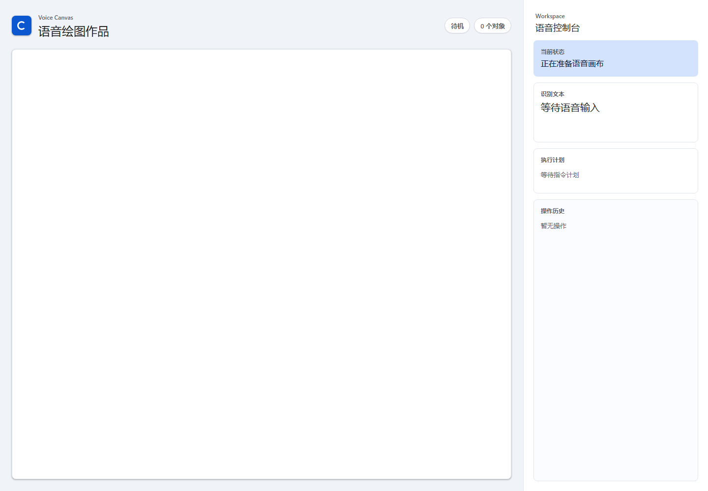
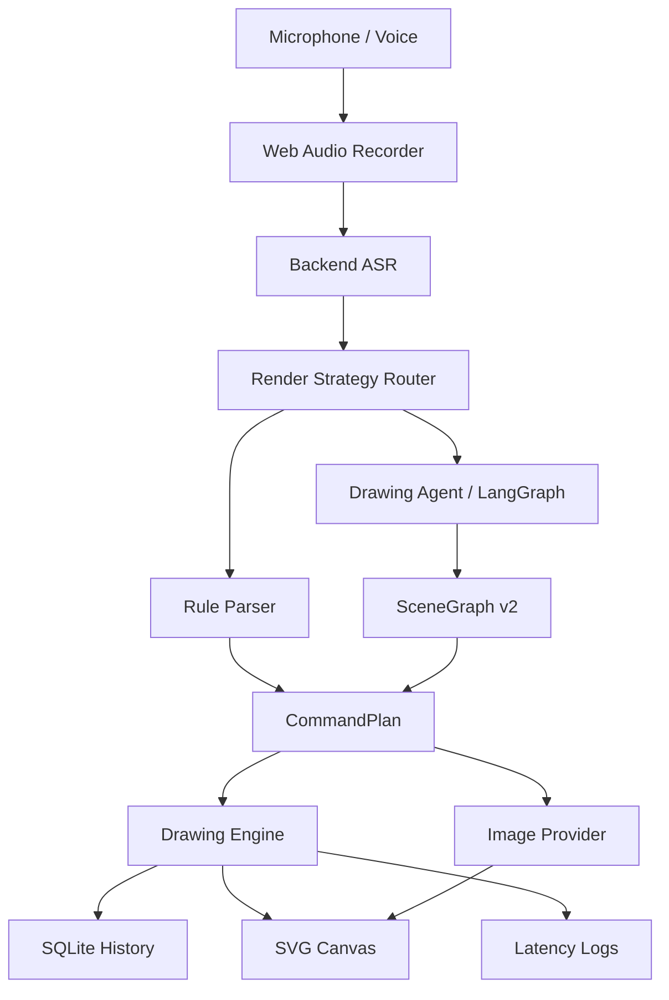

# AI Painting

<div align="center">

**A voice-first drawing agent for editable diagrams, vector scenes, and image refinement.**

**一款纯语音控制的可编辑绘图 Agent, 面向结构图、矢量场景、文生图与图生图精修。**

[](https://github.com/SakuraCianna/AI-Painting/actions/workflows/ai-painting-ci.yml)
[](https://www.python.org/)
[](https://nodejs.org/)
[](https://react.dev/)
[](https://fastapi.tiangolo.com/)
[](#quality)

[简体中文](#简体中文) | [English](#english)

</div>

---

## 简体中文

AI Painting 是一个 **只能通过语音完成创作的绘图工作台**。它不把鼠标拖拽、键盘快捷键或手工图形工具作为绘图入口, 而是把用户语音转成可验证、可撤销、可继续编辑的绘图计划。

它的目标不是做一个普通文生图 Demo, 而是做一套能长期扩展的绘图 Agent:

```txt
语音 -> ASR -> 渲染策略路由 -> 规则解析 / Drawing Agent -> 结构化计划 -> SVG 画布 / 图片对象
```



### 目录

- [项目定位](#项目定位)
- [核心特性](#核心特性)
- [能力状态](#能力状态)
- [语音示例](#语音示例)
- [架构设计](#架构设计)
- [技术栈](#技术栈)
- [快速开始](#快速开始)
- [环境变量](#环境变量)
- [测试与质量](#测试与质量)
- [项目结构](#项目结构)
- [文档索引](#文档索引)
- [已知限制](#已知限制)
- [贡献](#贡献)

### 项目定位

AI Painting 的核心约束是:

> 用户不能使用鼠标或键盘绘图, 只能通过语音指令完成绘图创作、编辑、确认、撤销、恢复和导出。

因此项目采用 **矢量优先, 生图增强** 的设计:

- 对于结构精确的内容, 例如流程图、泳道图、甘特图、组织结构图、房子和简单场景, 使用程序化 SVG 渲染, 保证对象清晰、关系稳定、后续可编辑。
- 对于艺术表现型内容, 例如水墨画、二次元人物、写实插画、科幻场景和商业视觉图, 接入 GPT-image-2 或 OpenAI 兼容 Provider。
- 对于“精修我的图片”“丰富当前画面”“把右边那个人的眼睛调亮”这类追改, 使用图生图链路, 并继承原始图片、提示词、目标主体、目标区域和调整动作。

### 核心特性

- **纯语音绘图**: 前端以录音和语音反馈为主, 不提供鼠标拖拽绘图工具栏。
- **结构化计划**: 每条语音都会先变成 `CommandPlan` 或 `SceneGraph v2`, 再由受控执行器修改画布。
- **可编辑对象**: SVG 对象带有几何信息、样式、语义标签、分组和层级, 后续可以继续用语音选择和修改。
- **复杂指令拆解**: Drawing Agent 能把复杂场景拆成多个步骤, 例如房子结构、流程节点、组织层级、项目排期和 UI 草图。
- **安全确认链**: 清空画布等高风险操作会保留 `requires_confirmation`, 只有用户确认后才执行。
- **复合撤销**: 一条语音生成的多步操作可以作为一个整体撤销和恢复。
- **ASR 多级兜底**: 小米 MiMo ASR 优先, 本地 Qwen3-ASR 和 Web Speech API 作为备用路径。
- **图像生成与精修**: 支持文生图 Provider 和图生图 Provider 抽象, 可配置中转站或 OpenAI 官方备用配置。
- **可观测延迟**: 记录 ASR、规则解析、Agent 规划、执行和端到端耗时, 便于后续优化响应速度。
- **CI 覆盖**: GitHub Actions 会运行后端测试、前端测试、前端构建、Docker 校验和 API smoke test。

### 能力状态

| 能力 | 当前状态 | 示例 |
| --- | --- | --- |
| 基础图形 | 已支持 | “画一个蓝色圆形在中间, 半径一百” |
| 复合场景 | 已支持 | “画一个房子, 红色屋顶, 蓝色门, 两扇窗户” |
| 批量绘制 | 已支持 | “画三颗黄色星星, 从左到右变小” |
| 语义编辑 | 已支持 | “把房子的窗户都变大” |
| 高级选择 | 已支持 | “把屋顶下面的门改成绿色” |
| 复合撤销 | 已支持 | 一次撤销整条语音计划 |
| 清空确认 | 已支持 | “清空画布” -> “确认清空” |
| Agent 模板 | 已支持第一版 | 客厅、流程图、自定义泳道图、信息图、海报、UI 草图、组织结构图、甘特图 |
| 文生图 | Provider 链路已支持 | “生成一张二次元动漫人物” |
| 图生图精修 | Provider 链路已支持 | “把右边那个人的眼睛调亮”“继续把他的头发柔和一点” |
| 本地 ASR | 服务脚手架已支持 | Qwen3-ASR HTTP 服务 |
| 商业级验证 | 进行中 | 真实 ASR 样本、真实图像模型效果、无鼠标端到端验收仍需补齐 |

### 语音示例

```txt
新建一张横向白色画布
画一个房子, 红色屋顶, 蓝色门, 两扇窗户
画一个温馨的小屋, 左边有两棵树, 右边有一条弯曲小路, 天空有三朵云
画一个语音绘图流程图, 从用户语音到 ASR, 再到规划器, 最后到画布执行
画一个泳道图, 包含销售、运营和交付
画一个泳道图, 泳道包括产品、设计、研发、测试
画一个泳道图, 泳道包括产品、设计、研发、测试, 节点包括需求评审、原型设计、开发联调、验收发布
画一个产品迭代项目排期甘特图, 包含需求、设计、开发、测试和上线里程碑
把左边第二棵树改成黄色
把卡片里和标题同一行的按钮改成绿色
生成一张二次元动漫人物
精修我的图片
把右边那个人的眼睛调亮
继续把他的头发柔和一点
再亮一点
同一个人衣服亮一点
左边那个也这样处理
清空画布
确认清空
撤销
恢复
导出 PNG
```

### 架构设计



#### 渲染策略

| 用户意图 | 默认路径 | 原因 |
| --- | --- | --- |
| 流程图、泳道图、UML、ER、甘特图、组织结构图 | 程序生成 | 文字清晰、关系线稳定、对象可精确编辑 |
| 房子、树、太阳、草地、简单场景组合 | 程序生成 | 结构明确, 适合 SVG 对象和语义标签 |
| 水墨画、二次元、写实插画、科幻场景 | 生图模型 | 重点是风格统一、细节丰富和艺术表现 |
| 精修、丰富、风格转换、局部重绘 | 图生图模型 | 保留已有画面, 对指定区域进行视觉增强 |

#### 后端 API

| Endpoint | 用途 |
| --- | --- |
| `GET /health` | 健康检查 |
| `POST /api/artworks` | 创建作品 |
| `GET /api/artworks` | 作品列表 |
| `POST /api/commands/parse` | 只解析语音文本, 不执行 |
| `POST /api/artworks/{artwork_id}/commands` | 解析并执行语音命令 |
| `POST /api/artworks/{artwork_id}/undo` | 撤销 |
| `POST /api/artworks/{artwork_id}/redo` | 恢复 |
| `GET /api/asr/providers` | 查看 ASR Provider 状态 |
| `POST /api/asr/transcribe` | 后端 ASR 转写 |
| `POST /api/tts/synthesize` | TTS 反馈语音 |
| `GET /api/metrics/latency` | 延迟指标 |

### 技术栈

| 层 | 技术 |
| --- | --- |
| Backend | Python 3.12.10, FastAPI, SQLite, pytest, pytest-cov |
| Agent | LangGraph, SceneGraph v2, Pydantic schema validation |
| Frontend | React 19, TypeScript, Vite, Web Audio API, Web Speech API, Iconify |
| AI Providers | Xiaomi MiMo ASR, Xiaomi MiMo-v2.5-Pro, Xiaomi MiMo TTS, Qwen3-ASR local fallback, OpenAI-compatible image APIs |
| Quality | GitHub Actions, Vitest coverage, Docker Compose validation |

### 快速开始

#### 1. 环境要求

- Windows 11
- PowerShell 7
- Python 3.12.10
- Node.js 24
- npm
- Chromium 内核浏览器或其他支持麦克风录音的浏览器

#### 2. 安装依赖

```powershell
py -3.12 --version
py -3.12 -m venv .venv
.\.venv\Scripts\python.exe -m pip install --upgrade pip
.\.venv\Scripts\python.exe -m pip install -r backend\requirements.txt
npm ci --prefix frontend
```

#### 3. 配置环境变量

没有真实模型密钥时, 项目仍可以使用占位 Provider 跑通主要开发流程。需要真实 ASR、TTS、Agent 或图像模型时, 复制示例文件:

```powershell
Copy-Item .env.example .env
```

#### 4. 启动开发环境

推荐使用快速启动脚本:

```powershell
.\快速启动.bat
```

默认服务地址:

- Backend: `http://127.0.0.1:8084`
- Frontend: `http://127.0.0.1:3001`

也可以手动启动:

```powershell
.\.venv\Scripts\python.exe -m uvicorn app.main:app --app-dir backend --host 127.0.0.1 --port 8084 --reload
```

```powershell
$env:VITE_API_BASE_URL = "http://127.0.0.1:8084"
npm run dev --prefix frontend -- --host 127.0.0.1 --port 3001 --strictPort
```

#### 5. 可选启动本地 Qwen3-ASR

```powershell
.\.venv\Scripts\python.exe -m pip install -r backend\requirements-local-asr.txt
.\.venv\Scripts\python.exe backend\local_asr_qwen3.py
```

更多说明见 [docs/local-asr-qwen3.md](docs/local-asr-qwen3.md)。

### 环境变量

| 变量 | 说明 | 默认值 |
| --- | --- | --- |
| `VITE_API_BASE_URL` | 前端请求后端地址 | `http://127.0.0.1:8084` |
| `AI_PAINTING_DB` | SQLite 数据库路径 | `backend\data\ai_painting.sqlite3` |
| `AI_PAINTING_CORS_ORIGINS` | 后端 CORS 允许来源 | `http://localhost:3001,http://127.0.0.1:3001` |
| `MIMO_API_KEY` | 小米 MiMo API Key | 空 |
| `AI_PAINTING_ASR_PROVIDERS` | 后端 ASR Provider 顺序 | `xiaomi,local` |
| `AI_PAINTING_ENABLE_AGENT_PLANNER` | 启用 Drawing Agent | `true` |
| `AI_PAINTING_MIMO_LLM_MODEL` | 小米复杂指令规划模型 | `mimo-v2.5-pro` |
| `AI_PAINTING_LOCAL_ASR_URL` | 本地 ASR HTTP 服务地址 | `http://127.0.0.1:9001/asr` |
| `AI_PAINTING_IMAGE_PROVIDER` | 文生图 Provider | `openai_compatible` 或 `placeholder` |
| `AI_PAINTING_TEXT_IMAGE_BASE_URL` | OpenAI 兼容文生图 Base URL | 见 `.env.example` |
| `AI_PAINTING_TEXT_IMAGE_MODEL` | 文生图模型 | `gpt-image-2` |
| `AI_PAINTING_IMAGE_EDIT_PROVIDER` | 图生图 Provider | `openai_compatible` 或 `placeholder` |
| `AI_PAINTING_IMAGE_EDIT_BASE_URL` | OpenAI 兼容图生图 Base URL | 见 `.env.example` |
| `AI_PAINTING_IMAGE_EDIT_MODEL` | 图生图模型 | `gpt-image-2` |
| `AI_PAINTING_OPENAI_API_KEY` | OpenAI 官方备用 API Key | 空 |
| `AI_PAINTING_OPENAI_BASE_URL` | OpenAI 官方备用 Base URL | `https://api.openai.com/v1` |

不要把真实密钥写入 README、Issue、PR、提交信息或日志。

### 测试与质量

```powershell
.\.venv\Scripts\python.exe -m pytest backend\tests -q
.\.venv\Scripts\python.exe -m pytest backend\tests --cov=app --cov-report=term-missing --cov-fail-under=85
npm run test:coverage --prefix frontend
npm run build --prefix frontend
git diff --check
```

CI 在 `push`、`pull_request` 和手动触发时运行:

- Python 依赖安装
- 后端 compileall
- 后端测试与 85% 覆盖率门槛
- 前端 Vitest 覆盖率
- 前端生产构建
- Docker Compose 配置校验
- Docker 备用镜像构建
- FastAPI `/health` smoke test

### Docker

Docker 是备用部署方式, 本地开发默认使用 `快速启动.bat`。

```powershell
docker compose -f docker-compose.yml config --quiet
docker compose -f docker-compose.yml build
docker compose up
```

更多说明见 [docs/docker-deploy.md](docs/docker-deploy.md)。

### 项目结构

```txt
.
├── backend
│   ├── app
│   │   ├── agent
│   │   ├── asr.py
│   │   ├── command_parser.py
│   │   ├── drawing_engine.py
│   │   ├── image_generation.py
│   │   ├── main.py
│   │   └── repositories.py
│   ├── local_asr_qwen3.py
│   ├── requirements.txt
│   └── tests
├── frontend
│   ├── src
│   ├── package.json
│   └── vite.config.ts
├── docs
│   ├── agent-architecture.md
│   ├── evaluation
│   ├── local-asr-qwen3.md
│   └── status
├── .github
├── .env.example
├── docker-compose.yml
├── ROADMAP.md
├── 需求文档.md
├── 设计文档.md
└── 快速启动.bat
```

### 文档索引

- [产品路线图](ROADMAP.md)
- [设计文档](设计文档.md)
- [需求文档](需求文档.md)
- [Drawing Agent 架构](docs/agent-architecture.md)
- [当前差距评估](docs/status/voice-drawing-gap-analysis.md)
- [ASR 样本评测](docs/evaluation/asr-benchmark.md)
- [本地 Qwen3-ASR](docs/local-asr-qwen3.md)
- [Docker 备用部署](docs/docker-deploy.md)

### 已知限制

- 当前处于 MVP 后产品化扩展阶段, 还不是已经完成商业级验收的产品。
- 小米 ASR、本地 Qwen3-ASR、真实麦克风输入和 GPT-image-2 出图质量仍需要更多真实样本评测。
- 图生图局部精修目前主要依赖文本目标描述和上一轮图片元数据, 尚未实现视觉分割、mask 编辑或自动目标检测。
- SVG 是当前主编辑层, 复杂像素级笔刷、滤镜、大画布和高频动画仍需要 Canvas / OffscreenCanvas 增强。
- 浏览器麦克风授权、自动播放和下载行为受浏览器安全策略影响。

### 贡献

提交 PR 前请阅读:

- [.github/README.md](.github/README.md)
- [.github/PULL_REQUEST_TEMPLATE.md](.github/PULL_REQUEST_TEMPLATE.md)
- [.github/ISSUE_TEMPLATE/bug_report.md](.github/ISSUE_TEMPLATE/bug_report.md)

PR 描述需要包含修改内容、修改原因、关键文件、已运行检查、检查结果、已知风险、截图或录屏以及后续建议。

---

## English

AI Painting is a **voice-only drawing workspace**. It does not expose mouse dragging, keyboard shortcuts, or manual shape tools as the drawing interface. Instead, it turns voice commands into validated, undoable, and continuously editable drawing plans.

The goal is not to build a generic text-to-image demo. The goal is to build an extensible drawing agent:

```txt
Voice -> ASR -> Render Strategy Router -> Rule Parser / Drawing Agent -> Structured Plan -> SVG Canvas / Image Object
```


### Table of Contents

- [Positioning](#positioning)
- [Features](#features)
- [Capability Status](#capability-status)
- [Voice Examples](#voice-examples)
- [Architecture](#architecture)
- [Tech Stack](#tech-stack)
- [Quick Start](#quick-start)
- [Environment Variables](#environment-variables)
- [Quality](#quality)
- [Repository Layout](#repository-layout)
- [Documentation](#documentation)
- [Known Limitations](#known-limitations)
- [Contributing](#contributing)

### Positioning

AI Painting follows one central constraint:

> Users must create, edit, confirm, undo, redo, and export drawings through voice commands only.

The product design is therefore **vector-first, generative-enhanced**:

- For precision-oriented outputs, such as flowcharts, swimlane diagrams, Gantt charts, org charts, houses, and simple scenes, AI Painting uses programmatic SVG rendering so text remains readable, relations stay stable, and objects remain editable.
- For art-oriented outputs, such as ink painting, anime characters, realistic illustration, sci-fi scenes, and commercial visuals, it can call GPT-image-2 or another OpenAI-compatible image provider.
- For follow-up edits such as "refine my image", "make the right person's eyes brighter", or "make it brighter again", it uses image-to-image refinement with the source image, source prompt, target subject, target region, and adjustment metadata.

### Features

- **Voice-first creation**: recording and voice feedback are the primary controls. A mouse-based drawing toolbar is intentionally absent.
- **Structured planning**: every command becomes a `CommandPlan` or `SceneGraph v2` before it mutates the canvas.
- **Editable objects**: SVG objects carry geometry, styles, semantic tags, grouping, and layer metadata.
- **Complex command decomposition**: the Drawing Agent can break scenes into steps for houses, flows, org charts, Gantt charts, posters, and UI drafts.
- **Confirmation safety**: risky operations such as clearing the canvas keep `requires_confirmation` and only execute after explicit confirmation.
- **Grouped undo**: multi-step voice plans can be undone and redone as a single semantic action.
- **ASR fallback chain**: Xiaomi MiMo ASR first, local Qwen3-ASR and Web Speech API as fallback options.
- **Image generation and refinement**: text-to-image and image-to-image providers are abstracted behind configurable provider adapters.
- **Latency observability**: ASR, rule parsing, agent planning, execution, and end-to-end latency are logged.
- **CI coverage**: GitHub Actions runs backend tests, frontend tests, frontend builds, Docker validation, and API smoke checks.

### Capability Status

| Capability | Status | Example |
| --- | --- | --- |
| Basic shapes | Supported | "Draw a blue circle in the center with radius 100" |
| Composite scenes | Supported | "Draw a house with a red roof, blue door, and two windows" |
| Batch drawing | Supported | "Draw three yellow stars, shrinking from left to right" |
| Semantic editing | Supported | "Make all house windows bigger" |
| Advanced selection | Supported | "Change the door below the roof to green" |
| Grouped undo | Supported | Undo one full voice plan at a time |
| Clear confirmation | Supported | "Clear canvas" -> "Confirm clear" |
| Agent templates | First version supported | Living room, flowchart, custom swimlane diagram, infographic, poster, UI wireframe, org chart, Gantt chart |
| Text-to-image | Provider pipeline supported | "Generate an anime character" |
| Image-to-image | Provider pipeline supported | "把右边那个人的眼睛调亮", then "继续把他的头发柔和一点" |
| Local ASR | Scaffold supported | Qwen3-ASR HTTP service |
| Production validation | In progress | Real ASR samples, real image quality, and no-mouse E2E validation still need more work |

### Voice Examples

```txt
Create a horizontal white canvas
Draw a house with a red roof, blue door, and two windows
Draw a cozy cabin with two trees on the left, a curved road on the right, and three clouds in the sky
Draw a voice drawing flowchart from user voice to ASR, then to the planner, then to canvas execution
画一个泳道图, 包含销售、运营和交付
画一个泳道图, 泳道包括产品、设计、研发、测试
画一个泳道图, 泳道包括产品、设计、研发、测试, 节点包括需求评审、原型设计、开发联调、验收发布
Draw a product iteration Gantt chart with requirements, design, development, testing, and launch milestones
Change the second tree on the left to yellow
Change the button inside the card and on the same row as the title to green
Generate an anime character
精修我的图片
把右边那个人的眼睛调亮
继续把他的头发柔和一点
再亮一点
同一个人衣服亮一点
左边那个也这样处理
Clear canvas
Confirm clear
Undo
Redo
Export PNG
```

### Architecture


#### Render Strategy

| Intent | Default Path | Why |
| --- | --- | --- |
| Flowcharts, swimlane diagrams, UML, ER diagrams, Gantt charts, org charts | Programmatic rendering | Text must stay readable, relation lines must stay stable, and objects must remain editable |
| Houses, trees, sun, grass, simple scene compositions | Programmatic rendering | The object structure is explicit and works well with SVG semantic tags |
| Ink painting, anime, realistic illustration, sci-fi scenes | Image generation | Visual style, consistency, and detail matter more than object-level editing |
| Refinement, enrichment, style transfer, local repainting | Image-to-image | Existing composition should be preserved while specific areas are improved |

#### API Surface

| Endpoint | Purpose |
| --- | --- |
| `GET /health` | Health check |
| `POST /api/artworks` | Create artwork |
| `GET /api/artworks` | List artworks |
| `POST /api/commands/parse` | Parse command without execution |
| `POST /api/artworks/{artwork_id}/commands` | Parse and execute a voice command |
| `POST /api/artworks/{artwork_id}/undo` | Undo |
| `POST /api/artworks/{artwork_id}/redo` | Redo |
| `GET /api/asr/providers` | Inspect ASR provider status |
| `POST /api/asr/transcribe` | Backend ASR transcription |
| `POST /api/tts/synthesize` | TTS voice feedback |
| `GET /api/metrics/latency` | Latency metrics |

### Tech Stack

| Layer | Stack |
| --- | --- |
| Backend | Python 3.12.10, FastAPI, SQLite, pytest, pytest-cov |
| Agent | LangGraph, SceneGraph v2, Pydantic schema validation |
| Frontend | React 19, TypeScript, Vite, Web Audio API, Web Speech API, Iconify |
| AI Providers | Xiaomi MiMo ASR, Xiaomi MiMo-v2.5-Pro, Xiaomi MiMo TTS, Qwen3-ASR local fallback, OpenAI-compatible image APIs |
| Quality | GitHub Actions, Vitest coverage, Docker Compose validation |

### Quick Start

#### 1. Requirements

- Windows 11
- PowerShell 7
- Python 3.12.10
- Node.js 24
- npm
- A browser with microphone recording support

#### 2. Install

```powershell
py -3.12 --version
py -3.12 -m venv .venv
.\.venv\Scripts\python.exe -m pip install --upgrade pip
.\.venv\Scripts\python.exe -m pip install -r backend\requirements.txt
npm ci --prefix frontend
```

#### 3. Configure

The app can run through placeholder providers without real model keys. For real ASR, TTS, agent planning, or image providers:

```powershell
Copy-Item .env.example .env
```

#### 4. Run

Recommended startup:

```powershell
.\快速启动.bat
```

Default service URLs:

- Backend: `http://127.0.0.1:8084`
- Frontend: `http://127.0.0.1:3001`

Manual backend:

```powershell
.\.venv\Scripts\python.exe -m uvicorn app.main:app --app-dir backend --host 127.0.0.1 --port 8084 --reload
```

Manual frontend:

```powershell
$env:VITE_API_BASE_URL = "http://127.0.0.1:8084"
npm run dev --prefix frontend -- --host 127.0.0.1 --port 3001 --strictPort
```

#### 5. Optional Local Qwen3-ASR

```powershell
.\.venv\Scripts\python.exe -m pip install -r backend\requirements-local-asr.txt
.\.venv\Scripts\python.exe backend\local_asr_qwen3.py
```

See [docs/local-asr-qwen3.md](docs/local-asr-qwen3.md).

### Environment Variables

| Variable | Description | Default |
| --- | --- | --- |
| `VITE_API_BASE_URL` | Frontend API base URL | `http://127.0.0.1:8084` |
| `AI_PAINTING_DB` | SQLite database path | `backend\data\ai_painting.sqlite3` |
| `AI_PAINTING_CORS_ORIGINS` | Allowed backend CORS origins | `http://localhost:3001,http://127.0.0.1:3001` |
| `MIMO_API_KEY` | Xiaomi MiMo API key | empty |
| `AI_PAINTING_ASR_PROVIDERS` | Backend ASR provider order | `xiaomi,local` |
| `AI_PAINTING_ENABLE_AGENT_PLANNER` | Enable Drawing Agent planner | `true` |
| `AI_PAINTING_MIMO_LLM_MODEL` | Xiaomi complex planning model | `mimo-v2.5-pro` |
| `AI_PAINTING_LOCAL_ASR_URL` | Local ASR HTTP service URL | `http://127.0.0.1:9001/asr` |
| `AI_PAINTING_IMAGE_PROVIDER` | Text-to-image provider | `openai_compatible` or `placeholder` |
| `AI_PAINTING_TEXT_IMAGE_BASE_URL` | OpenAI-compatible generation base URL | see `.env.example` |
| `AI_PAINTING_TEXT_IMAGE_MODEL` | Text-to-image model | `gpt-image-2` |
| `AI_PAINTING_IMAGE_EDIT_PROVIDER` | Image edit provider | `openai_compatible` or `placeholder` |
| `AI_PAINTING_IMAGE_EDIT_BASE_URL` | OpenAI-compatible image edit base URL | see `.env.example` |
| `AI_PAINTING_IMAGE_EDIT_MODEL` | Image edit model | `gpt-image-2` |
| `AI_PAINTING_OPENAI_API_KEY` | Official OpenAI fallback API key | empty |
| `AI_PAINTING_OPENAI_BASE_URL` | Official OpenAI fallback base URL | `https://api.openai.com/v1` |

Never put real secrets in README, issues, pull requests, commit messages, or logs.

### Quality

```powershell
.\.venv\Scripts\python.exe -m pytest backend\tests -q
.\.venv\Scripts\python.exe -m pytest backend\tests --cov=app --cov-report=term-missing --cov-fail-under=85
npm run test:coverage --prefix frontend
npm run build --prefix frontend
git diff --check
```

CI runs on `push`, `pull_request`, and manual dispatch:

- Python dependency installation
- Backend compileall
- Backend tests with 85% coverage gate
- Frontend Vitest coverage
- Frontend production build
- Docker Compose config validation
- Docker backup image build
- FastAPI `/health` smoke test

### Docker

Docker is a backup deployment path. Local development uses `快速启动.bat` by default.

```powershell
docker compose -f docker-compose.yml config --quiet
docker compose -f docker-compose.yml build
docker compose up
```

See [docs/docker-deploy.md](docs/docker-deploy.md).

### Repository Layout

```txt
.
├── backend
│   ├── app
│   │   ├── agent
│   │   ├── asr.py
│   │   ├── command_parser.py
│   │   ├── drawing_engine.py
│   │   ├── image_generation.py
│   │   ├── main.py
│   │   └── repositories.py
│   ├── local_asr_qwen3.py
│   ├── requirements.txt
│   └── tests
├── frontend
│   ├── src
│   ├── package.json
│   └── vite.config.ts
├── docs
│   ├── agent-architecture.md
│   ├── evaluation
│   ├── local-asr-qwen3.md
│   └── status
├── .github
├── .env.example
├── docker-compose.yml
├── ROADMAP.md
├── 需求文档.md
├── 设计文档.md
└── 快速启动.bat
```

### Documentation

- [Roadmap](ROADMAP.md)
- [Design Document](设计文档.md)
- [Requirements Document](需求文档.md)
- [Drawing Agent Architecture](docs/agent-architecture.md)
- [Gap Analysis](docs/status/voice-drawing-gap-analysis.md)
- [ASR Benchmarking](docs/evaluation/asr-benchmark.md)
- [Local Qwen3-ASR](docs/local-asr-qwen3.md)
- [Docker Deployment](docs/docker-deploy.md)

### Known Limitations

- The project is in post-MVP productization, not a fully validated commercial product.
- Xiaomi ASR, local Qwen3-ASR, real microphone input, and GPT-image-2 output quality still need more real-world evaluation.
- Local image refinement currently relies on textual target descriptions and previous image metadata. Visual segmentation, mask editing, and automatic target detection are not implemented yet.
- SVG is the main editing layer. Pixel brushes, filters, large canvases, and high-frequency animations still need Canvas / OffscreenCanvas enhancement.
- Browser microphone permissions, autoplay behavior, and downloads depend on browser security policies.

### Contributing

Before opening a pull request, read:

- [.github/README.md](.github/README.md)
- [.github/PULL_REQUEST_TEMPLATE.md](.github/PULL_REQUEST_TEMPLATE.md)
- [.github/ISSUE_TEMPLATE/bug_report.md](.github/ISSUE_TEMPLATE/bug_report.md)

PR descriptions should include scope, motivation, key files, checks run, results, known risks, screenshots or recordings for UI changes, and follow-up work.
