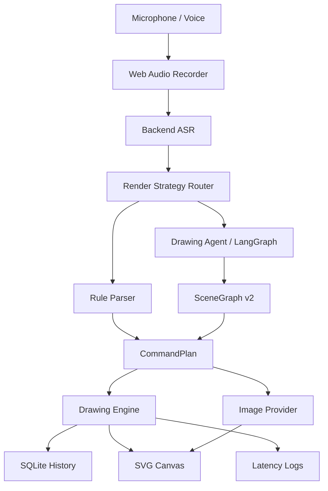

# AI Painting

**A voice-first drawing agent for editable diagrams, vector scenes, and image refinement.**

[](https://github.com/SakuraCianna/AI-Painting/actions/workflows/ai-painting-ci.yml)
[](https://www.python.org/)
[](https://nodejs.org/)
[](https://react.dev/)
[](https://fastapi.tiangolo.com/)
[](#quality)

[简体中文](README.md) | [English](README_EN.md)

---

AI Painting is a **voice-only drawing workspace**. It does not expose mouse dragging, keyboard shortcuts, or manual shape tools as the drawing interface. Instead, it turns voice commands into validated, undoable, and continuously editable drawing plans.

The goal is not to build a generic text-to-image demo. The goal is to build an extensible drawing agent:

```txt
Voice -> ASR -> Render Strategy Router -> Rule Parser / Drawing Agent -> Structured Plan -> SVG Canvas / Image Object
```


### Table of Contents

- [Positioning](#positioning)
- [Features](#features)
- [Capability Status](#capability-status)
- [Voice Examples](#voice-examples)
- [Architecture](#architecture)
- [Tech Stack](#tech-stack)
- [Quick Start](#quick-start)
- [Environment Variables](#environment-variables)
- [Quality](#quality)
- [Repository Layout](#repository-layout)
- [Documentation](#documentation)
- [Known Limitations](#known-limitations)
- [Contributing](#contributing)

### Positioning

AI Painting follows one central constraint:

> Users must create, edit, confirm, undo, redo, and export drawings through voice commands only.

The product design is therefore **vector-first, generative-enhanced**:

- For precision-oriented outputs, such as flowcharts, swimlane diagrams, Gantt charts, org charts, houses, and simple scenes, AI Painting uses programmatic SVG rendering so text remains readable, relations stay stable, and objects remain editable.
- For art-oriented outputs, such as ink painting, anime characters, realistic illustration, sci-fi scenes, and commercial visuals, it can call GPT-image-2 or another OpenAI-compatible image provider.
- For follow-up edits such as "refine my image", "make the right person's eyes brighter", or "make it brighter again", it uses image-to-image refinement with the source image, source prompt, target subject, target region, and adjustment metadata.

### Features

- **Voice-first creation**: recording and voice feedback are the primary controls. A mouse-based drawing toolbar is intentionally absent.
- **Structured planning**: every command becomes a `CommandPlan` or `SceneGraph v2` before it mutates the canvas.
- **Editable objects**: SVG objects carry geometry, styles, semantic tags, grouping, and layer metadata.
- **Complex command decomposition**: the Drawing Agent can break scenes into steps for houses, flows, org charts, Gantt charts, posters, and UI drafts.
- **Confirmation safety**: risky operations such as clearing the canvas keep `requires_confirmation` and only execute after explicit confirmation.
- **Grouped undo**: multi-step voice plans can be undone and redone as a single semantic action.
- **ASR fallback chain**: Xiaomi MiMo ASR first, local Qwen3-ASR and Web Speech API as fallback options.
- **Image generation and refinement**: text-to-image and image-to-image providers are abstracted behind configurable provider adapters.
- **Latency observability**: ASR, rule parsing, agent planning, execution, and end-to-end latency are logged.
- **CI coverage**: GitHub Actions runs backend tests, frontend tests, frontend builds, Docker validation, and API smoke checks.

### Capability Status

| Capability | Status | Example |
| --- | --- | --- |
| Basic shapes | Supported | "Draw a blue circle in the center with radius 100" |
| Composite scenes | Supported | "Draw a house with a red roof, blue door, and two windows" |
| Batch drawing | Supported | "Draw three yellow stars, shrinking from left to right" |
| Semantic editing | Supported | "Make all house windows bigger" |
| Advanced selection | Supported | "Change the door below the roof to green" |
| Grouped undo | Supported | Undo one full voice plan at a time |
| Clear confirmation | Supported | "Clear canvas" -> "Confirm clear" |
| Agent templates | First version supported | Living room, flowchart, system architecture diagram, custom ER diagram, custom swimlane diagram, infographic, poster, UI wireframe, custom org chart, Gantt chart |
| Text-to-image | Provider pipeline supported | "Generate an anime character" |
| Image-to-image | Provider pipeline supported | "把右边那个人的眼睛调亮", then "继续把他的头发柔和一点" |
| Voice export | Supported | "Export PNG", "导出 SVG", "导出项目 JSON" |
| Local ASR | Scaffold supported | Qwen3-ASR HTTP service |
| Production validation | In progress | Real ASR samples, real image quality, and no-mouse E2E validation still need more work |

### Voice Examples

```txt
Create a horizontal white canvas
Draw a house with a red roof, blue door, and two windows
Draw a cozy cabin with two trees on the left, a curved road on the right, and three clouds in the sky
Draw a voice drawing flowchart from user voice to ASR, then to the planner, then to canvas execution
画一个AI绘图系统架构图, 包含前端、后端、ASR服务、Agent规划器、SQLite数据库和图像生成服务
画一个用户订单ER图, 包含用户、订单、商品和支付
画一个图书馆借阅ER图, 实体包括读者、图书、借阅记录、馆员, 关系包括读者借阅图书、馆员管理图书
画一个产品团队组织结构图, 包括负责人、产品经理、设计负责人、研发负责人、用户研究员、交互设计师、前端工程师、后端工程师
画一个泳道图, 包含销售、运营和交付
画一个泳道图, 泳道包括产品、设计、研发、测试
画一个泳道图, 泳道包括产品、设计、研发、测试, 节点包括需求评审、原型设计、开发联调、验收发布
Draw a product iteration Gantt chart with requirements, design, development, testing, and launch milestones
Change the second tree on the left to yellow
Change the button inside the card and on the same row as the title to green
Generate an anime character
精修我的图片
把右边那个人的眼睛调亮
继续把他的头发柔和一点
再亮一点
同一个人衣服亮一点
左边那个也这样处理
Clear canvas
Confirm clear
Undo
Redo
Export PNG
导出 SVG
导出项目 JSON
```

### Architecture



#### Render Strategy

| Intent | Default Path | Why |
| --- | --- | --- |
| Flowcharts, swimlane diagrams, system architecture diagrams, UML, ER diagrams, Gantt charts, org charts | Programmatic rendering | Text must stay readable, relation lines must stay stable, and objects must remain editable |
| Houses, trees, sun, grass, simple scene compositions | Programmatic rendering | The object structure is explicit and works well with SVG semantic tags |
| Ink painting, anime, realistic illustration, sci-fi scenes | Image generation | Visual style, consistency, and detail matter more than object-level editing |
| Refinement, enrichment, style transfer, local repainting | Image-to-image | Existing composition should be preserved while specific areas are improved |

#### API Surface

| Endpoint | Purpose |
| --- | --- |
| `GET /health` | Health check |
| `POST /api/artworks` | Create artwork |
| `GET /api/artworks` | List artworks |
| `POST /api/commands/parse` | Parse command without execution |
| `POST /api/artworks/{artwork_id}/commands` | Parse and execute a voice command |
| `POST /api/artworks/{artwork_id}/undo` | Undo |
| `POST /api/artworks/{artwork_id}/redo` | Redo |
| `GET /api/asr/providers` | Inspect ASR provider status |
| `POST /api/asr/transcribe` | Backend ASR transcription |
| `POST /api/tts/synthesize` | TTS voice feedback |
| `GET /api/metrics/latency` | Latency metrics |

### Tech Stack

| Layer | Stack |
| --- | --- |
| Backend | Python 3.12.10, FastAPI, SQLite, pytest, pytest-cov |
| Agent | LangGraph, SceneGraph v2, Pydantic schema validation |
| Frontend | React 19, TypeScript, Vite, Web Audio API, Web Speech API, Iconify |
| AI Providers | Xiaomi MiMo ASR, Xiaomi MiMo-v2.5-Pro, Xiaomi MiMo TTS, Qwen3-ASR local fallback, OpenAI-compatible image APIs |
| Quality | GitHub Actions, pytest-cov, Vitest coverage, Ruff, mypy, pre-commit, Docker Compose validation |

### Quick Start

#### 1. Requirements

- Windows 11
- PowerShell 7
- Python 3.12.10
- Node.js 24
- npm
- A browser with microphone recording support

#### 2. Install

```powershell
py -3.12 --version
py -3.12 -m venv .venv
.\.venv\Scripts\python.exe -m pip install --upgrade pip
.\.venv\Scripts\python.exe -m pip install -r backend\requirements.txt
npm ci --prefix frontend
```

#### 3. Configure

The app can run through placeholder providers without real model keys. For real ASR, TTS, agent planning, or image providers:

```powershell
Copy-Item .env.example .env
```

#### 4. Run

Recommended startup:

```powershell
.\快速启动.bat
```

Default service URLs:

- Backend: `http://127.0.0.1:8084`
- Frontend: `http://127.0.0.1:3001`

Manual backend:

```powershell
.\.venv\Scripts\python.exe -m uvicorn app.main:app --app-dir backend --host 127.0.0.1 --port 8084 --reload
```

Manual frontend:

```powershell
$env:VITE_API_BASE_URL = "http://127.0.0.1:8084"
npm run dev --prefix frontend -- --host 127.0.0.1 --port 3001 --strictPort
```

#### 5. Optional Local Qwen3-ASR

```powershell
.\.venv\Scripts\python.exe -m pip install -r backend\requirements-local-asr.txt
.\.venv\Scripts\python.exe backend\local_asr_qwen3.py
```

See [docs/local-asr-qwen3.md](docs/local-asr-qwen3.md).

### Environment Variables

| Variable | Description | Default |
| --- | --- | --- |
| `VITE_API_BASE_URL` | Frontend API base URL | `http://127.0.0.1:8084` |
| `AI_PAINTING_DB` | SQLite database path | `backend\data\ai_painting.sqlite3` |
| `AI_PAINTING_SQLITE_CACHE_SIZE_KIB` | SQLite connection page cache size in KiB | `8192` |
| `AI_PAINTING_CORS_ORIGINS` | Allowed backend CORS origins | `http://localhost:3001,http://127.0.0.1:3001` |
| `MIMO_API_KEY` | Xiaomi MiMo API key | empty |
| `AI_PAINTING_ASR_PROVIDERS` | Backend ASR provider order | `xiaomi,local` |
| `AI_PAINTING_ENABLE_AGENT_PLANNER` | Enable Drawing Agent planner | `true` |
| `AI_PAINTING_MIMO_LLM_MODEL` | Xiaomi complex planning model | `mimo-v2.5-pro` |
| `AI_PAINTING_LOCAL_ASR_URL` | Local ASR HTTP service URL | `http://127.0.0.1:9001/asr` |
| `AI_PAINTING_IMAGE_PROVIDER` | Text-to-image provider | `openai_compatible` or `placeholder` |
| `AI_PAINTING_TEXT_IMAGE_BASE_URL` | OpenAI-compatible generation base URL | see `.env.example` |
| `AI_PAINTING_TEXT_IMAGE_MODEL` | Text-to-image model | `gpt-image-2` |
| `AI_PAINTING_IMAGE_EDIT_PROVIDER` | Image edit provider | `openai_compatible` or `placeholder` |
| `AI_PAINTING_IMAGE_EDIT_BASE_URL` | OpenAI-compatible image edit base URL | see `.env.example` |
| `AI_PAINTING_IMAGE_EDIT_MODEL` | Image edit model | `gpt-image-2` |
| `AI_PAINTING_OPENAI_API_KEY` | Official OpenAI fallback API key | empty |
| `AI_PAINTING_OPENAI_BASE_URL` | Official OpenAI fallback base URL | `https://api.openai.com/v1` |

The OpenAI-compatible generation and edit request size is decided at runtime: blank-canvas generation uses the current canvas size, while image refinement keeps the source image dimensions. Fixed proxy size variables are no longer recommended.

Never put real secrets in README, issues, pull requests, commit messages, or logs.

### Quality

```powershell
.\.venv\Scripts\python.exe -m pytest backend\tests -q
.\.venv\Scripts\python.exe -m pytest backend\tests --cov=app --cov-report=term-missing --cov-fail-under=85
.\.venv\Scripts\python.exe -m ruff check backend\app backend\tests
.\.venv\Scripts\python.exe -m ruff format --check backend\app backend\tests
.\.venv\Scripts\python.exe -m mypy
.\.venv\Scripts\pre-commit.exe run --all-files
npm run test:coverage --prefix frontend
npm run test:e2e --prefix frontend
npm run build --prefix frontend
git diff --check
```

Real-provider evaluation harnesses:

```powershell
.\.venv\Scripts\python.exe backend\evaluate_asr_samples.py docs\evaluation\asr-samples.example.json --output reports\asr-xiaomi.json
.\.venv\Scripts\python.exe backend\evaluate_image_provider.py docs\evaluation\image-provider-samples.example.json --output reports\image-provider.json
```

CI runs on `push`, `pull_request`, and manual dispatch:

- Python dependency installation
- Ruff, Ruff format, gradual mypy, and pre-commit
- Backend compileall
- Backend tests with 85% coverage gate
- Frontend Vitest coverage
- Playwright voice-only e2e can be run locally
- Frontend production build
- Docker Compose config validation
- Docker backup image build
- FastAPI `/health` smoke test

### Docker

Docker is a backup deployment path. Local development uses `快速启动.bat` by default.

```powershell
docker compose -f docker-compose.yml config --quiet
docker compose -f docker-compose.yml build
docker compose up
```

See [docs/docker-deploy.md](docs/docker-deploy.md).

### Repository Layout

```txt
.
├── backend
│   ├── app
│   │   ├── agent
│   │   ├── asr.py
│   │   ├── command_parser.py
│   │   ├── drawing_engine.py
│   │   ├── image_generation.py
│   │   ├── main.py
│   │   └── repositories.py
│   ├── evaluate_asr_samples.py
│   ├── evaluate_image_provider.py
│   ├── local_asr_qwen3.py
│   ├── requirements.txt
│   └── tests
├── frontend
│   ├── src
│   ├── package.json
│   └── vite.config.ts
├── docs
│   ├── agent-architecture.md
│   ├── evaluation
│   ├── local-asr-qwen3.md
│   └── status
├── .github
├── .env.example
├── docker-compose.yml
├── ROADMAP.md
├── 需求文档.md
├── 设计文档.md
└── 快速启动.bat
```

### Documentation

- [Roadmap](ROADMAP.md)
- [Design Document](设计文档.md)
- [Requirements Document](需求文档.md)
- [Drawing Agent Architecture](docs/agent-architecture.md)
- [Gap Analysis](docs/status/voice-drawing-gap-analysis.md)
- [Complex Command Evaluation](docs/evaluation/command-evaluation.md)
- [ASR Benchmarking](docs/evaluation/asr-benchmark.md)
- [Image Provider Benchmarking](docs/evaluation/image-provider-benchmark.md)
- [Local Qwen3-ASR](docs/local-asr-qwen3.md)
- [Docker Deployment](docs/docker-deploy.md)

### Known Limitations

- The project is in post-MVP productization, not a fully validated commercial product.
- Xiaomi ASR, local Qwen3-ASR, real microphone input, and GPT-image-2 output quality still need more real-world evaluation.
- Local image refinement currently relies on textual target descriptions and previous image metadata. Visual segmentation, mask editing, and automatic target detection are not implemented yet.
- SVG is the main editing layer. Pixel brushes, filters, large canvases, and high-frequency animations still need Canvas / OffscreenCanvas enhancement.
- Browser microphone permissions, autoplay behavior, and downloads depend on browser security policies.

### Contributing

Before opening a pull request, read:

- [.github/GITHUB_WORKFLOW.md](.github/GITHUB_WORKFLOW.md)
- [.github/PULL_REQUEST_TEMPLATE.md](.github/PULL_REQUEST_TEMPLATE.md)
- [.github/ISSUE_TEMPLATE/bug_report.md](.github/ISSUE_TEMPLATE/bug_report.md)

PR descriptions should include scope, motivation, key files, checks run, results, known risks, screenshots or recordings for UI changes, and follow-up work.
